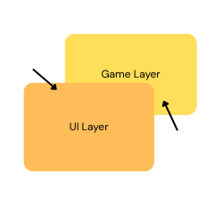

<h3 align="center">
    Build high performance GUI app with power of Game Engine (Bevy).
</h3>

### What is Makara? and Why Makara?

Makara is a UI Library built on top of Bevy engine.

[Bevy](https://bevy.org/) is a game engine written in Rust, based on 
[ECS](https://bevy.org/learn/quick-start/getting-started/ecs/) architecture. 
It's capable of rendering 2D and 3D graphics.

[Bevy](https://bevy.org/) also provides full UI system to build GPU accelerated GUI application but because it's based on 
[ECS](https://bevy.org/learn/quick-start/getting-started/ecs/), building UI with Bevy is verbosity.

Let's see an example below of creating a simple button with pure Bevy's UI.

```rust
fn setup(mut commands: Commands) {
    commands.spawn((
        Node {
            width: px(100),
            height: px(20),
            align_items: AlignItems::Center,
            justify_content: JustifyContent::Center,
            padding: UiRect::all(px(10)),
            ..default()
        },
        BorderRadius::all(px(8)),
        BackgroundColor(Color::srgb(1.0, 1.0, 1.0)),
        
        children![
            (
                Text::new("Click me"),
                TextColor(Color::BLACK)
            )
        ],
    
        observe(on_button_click)
    ))
}

fn on_button_click(_click: On<Pointer<Click>>) {
    // do something
}
```

As you can see, it's really easy to get lost with Bevy's UI. A real GUI application 
will have more than just a button and complex hierarchy.

**Makara** simplifies this problem but providing **built-in widgets** and high level api with builder pattern
that most rust devs familiar with, to make it easy to write and maintain the code.

Let's see how **Makara** reduce the verbosity.

```rust
fn setup(mut commands: Commands) {
    commands.spawn((
        button("Click me")
            .padding(px(10))
            .background_color("white")
            .build(),
        
        observe(on_button_click)
    ));
}

fn on_button_click(_clicked: On<Clicked>) {
    // do something
}
```
Now it's much cleaner compare to previous example.

Another motivation behind this project is the performance inherent to a modern game engine. 
Bevy utilizes a decoupled architecture consisting of a Spatial Simulation and 
an Interface Overlay. This allows for hardware-accelerated rendering of complex 
2D/3D meshes and custom shaders within the World Space, 
while maintaining a highly responsive, independent UI.

<p align="center">
  
</p>

That means you can render any kind of heavy graphic within your application without sacrifying performance.

### Core Features
- Built-in widgets including **button, modal, text input** and more.
- Leverages Bevy’s **massive parallelism** for smooth and efficient rendering.
- Routing systems.
- Custom styling with ID & Classes similar to HTML/CSS.
- High level API and flexible.


## Installation
```
cargo add makara
```
